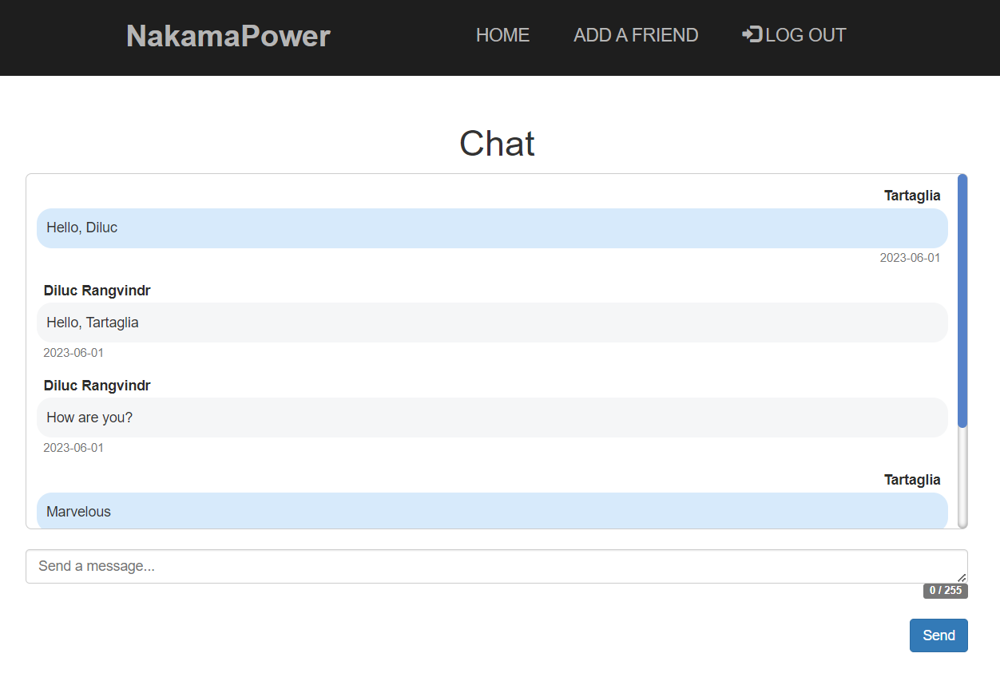

# Nakama Power

**Table of contents**

- [Nakama Power](#nakama-power)
  - [Introduction](#introduction)
    - [Database Schema](#database-schema)
    - [Project's directory structure](#projects-directory-structure)
  - [How to install](#how-to-install)
  - [How to use](#how-to-use)
    - [Login](#login)
    - [Sign up](#sign-up)
    - [Friendships Menu](#friendships-menu)
    - [Add a friend](#add-a-friend)
    - [Chat](#chat)
  - [Testing](#testing)

## Introduction

This is a project proposed by our teacher for the assignature of Markup Language (*Lenguaje de Marcas*). Our task was to create a frontend for the Java backend he passed us; however, as I'm a bit of a masochist, I decided to create my own backend from zero following the idea of the original backend, as I felt it was more easy and quick to create and use my own backend that learn how to use the backend provided by the professor (which unfortunately lacked things like a framework, project management tool, or portability), and that way I could better control and resolve any errors and bugs that I could encounter while developping the application.   

To achieve this, I decided to use Spring Boot to create an API REST to make HTTP petitions (POST, GET, PUT, and DELETE) to every entity (table) of the database, Thymeleaf to interact with the data received from the backend, JQuery to send HTTP petitions to the backend, MySQL for the database, and Docker to make the application portable.   

### Database Schema

There are four tables in the database `nakamapower`.


There are two attributes in the table `Countries`:
- **`code` (String):** Country's code.
- **`country` (String):** Country's name.


There are seven attributes in the table `Users`:
- **`id` (int):** User's ID.
- **`email` (String):** User's email.
- **`user` (String):** User's username.
- **`password` (String):** User's password.
- **`lastLog` (LocalDate):** User's last log in their account.
- **`session` (Integer):** Session number from the User's current logged account. If it's not logged in, it will be null.
- **`idCountry` (Countries):** Country's code associated with the user.


There are three attributes in the table `Friendship`:
- **`id` (int):** Friendship's ID.
- **`idUser` (Users):** User's ID associated with the friendship as the user who initiated the friendship.
- **`idFriend` (Users):** User's ID associated with the friendship as the user who was offered the friendship.


There are six attributes in the table `Messages`:
- **`id` (int):** Message's ID.
- **`chat` (Friendships):** Friendship's ID assigned and acting as the chat's ID.
- **`sender` (Users):** User's ID assigned as the sender.
- **`receptor` (Users):** User's ID assigned as the receptor.
- **`text` (String):** Text content of the message.
- **`date` (LocalDate):** Data in which the message was sent.


### Project's directory structure

- **`main/java/edu/craptocraft/nakamapower`**
  - **`App`:** Main app to execute the application.
  - **`controller`:** Controllers and endpoints of the API REST.
  - **`entity`:** Entities used to create the database's tables, plus another not-entity class.
  - **`repository`:** Repositories to access the methods of `CrudRepository`.
  - **`service`:** Interfaces of the methods used by the controllers.
    - **`implementation`:** Implementation of the methods of the interfaces.
- **`main/resources`**
  - **`static`:** CSS and images for the frontend.
  - **`templates`:** HTML webpages.
- **`test`:** Test cases for the application's backend.

## How to install

You will need to have already installed: `Git`, and `Docker`.   

1. First, open the terminal and go to the folder in which you desire to clone the repository. When you're inside, clone the repository:

    ```
    git clone https://github.com/ncocana/NakamaPower.git
    ```

2. Open the terminal and run the Docker compose file using the following command:

    ```
    docker-compose up
    ```

     

    This will create the needed containers (one for the MySQL database, and another for the application automatically building before a Docker image using the existing Dockerfile) and a network for the containers to connect with each other.   

    Upon executing the application for the first time, it will also populate it with some mock data. If this is something you don't want, you can go to the `App.java` file and comment the code inside `run(String... args)` function inserting Users and Friendships data along with the service attributes in the code (please, don't comment the code related to the Countries data being inserted as it's important for the app's correct perfomance). This will create instead an empty database, so you will have to create the desired data yourself (if an error happens when creating an empty database, you will need to go to the `src/main/resources/application.properties` file and change `spring.jpa.hibernate.ddl-auto` to `create` and then to `update` again after the first execution).   

    You will know the containers are fully and already created when you see a log saying `Started App` along with some logs of inserted data if you haven't the `run(String... args)` function from the `App.java` file:   

     

    To stop the containers, pulse Ctrl + C. Then you can delete the containers and its network with:

    ```
    docker-compose down
    ```

    Additionally, if you don't want to see the container's logs, you can run the Docker compose file in the background of the terminal with: `docker-compose up -d` (though I won't recommend it as the containers take some time to be fully started and seeing the logs could help you knowing when it's finished). The proccess to delete the containers and its network is the same as above.   

    You can view the container created with the command: `docker ps -a` (this will show you all the containers, running or not. To view only the ones running at the moment: `docker ps`).

    You can view the image created with the command: `docker images`.

    To remove the image, get its ID or name with the command from above and do this command: `docker rmi <image's ID or name>`. Using a random ID as example, the command would be as follow: `docker rmi ac6d8c993fa7`.

    You can enter the container with: `docker exec -it nakamapower bash`.

## How to use

Enter to the following link to see the webpage of the application: [http://127.0.0.1:8080/](http://127.0.0.1:8080/)

### Login

This is the homepage you will see if you're not logged in.   

You will need to enter an already existing email and password from one of the User entries in the Users table. You can use one of the User accounts already created uppon executing the app for the first time, or choose the sign up option to create a new User account.   


### Sign up

You will be asked to enter your full name, email address, a password, and select a country. Once you hit the sign up button, your account will be automatically created and you'll be able to sign in the application with it.   


### Friendships Menu

This is the homepage you'll see once signed in. You can see a table with the data from the `Friendship` table, along with a column with two buttons to chat with that User or delete your friendship with the User.

The data you see will be the one associated with your User account. You won't be able to see the friendships you're not part of.   


### Add a friend

Here you can add a new Friendship to your Friendship Menu. You won't be able to add a Friendship that already exists.   


### Chat

You can chat with an User you're friend of here. If you intend to chat with yourself with different accounts, you will need to log out and in with the respective account each time you send a message with a different User account.   



## Testing

To run the tests, you will need to run the `docker-compose up` command to start the containers and then enter inside the app container with this command:   

```
docker exec -it nakamapower bash
```

Once inside, the only thing you need to do is run the maven command to start the tests:   

```
mvn test
```

This will run all the tests cases created and output if they were successful or not.   


